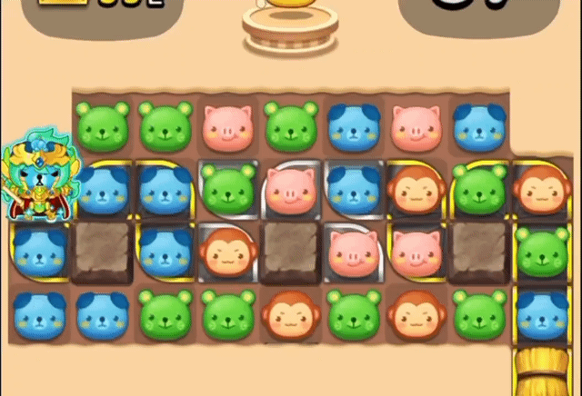
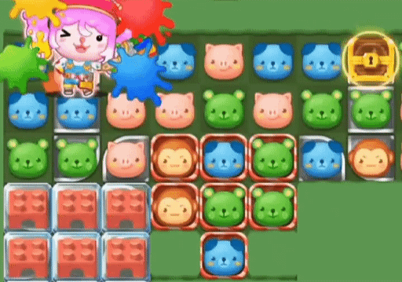
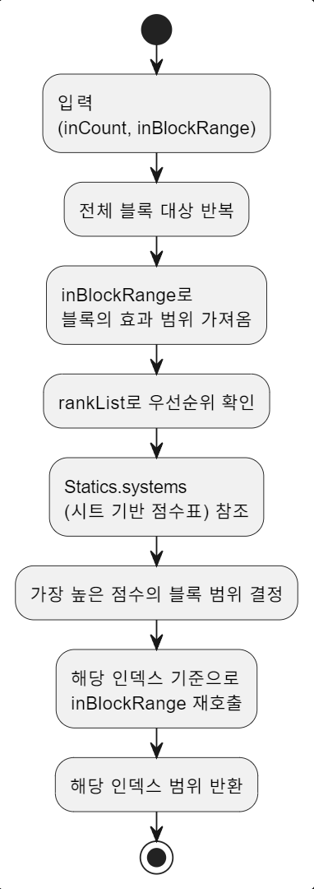
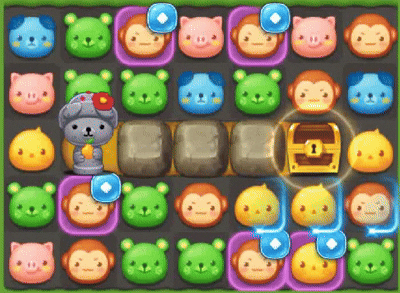
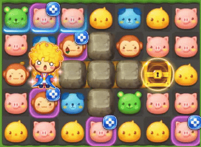
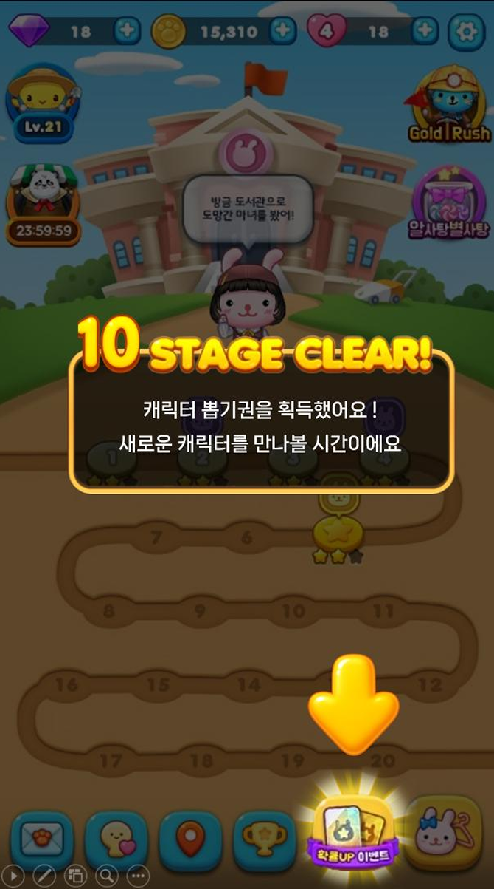

**Tech Keywords**
- Priority-based Algorithm
- Range Scan System
- State Machine
- Skill Logic Design

# 캐릭터 스킬 개발

이 문서는 퍼즐 게임 내 등장 캐릭터들의 고유 능력을 구현한 사례들을 정리한 문서입니다.  
내부 우선순위 탐색 로직, 범위 기반 타격, 상태 변화 등의 핵심 기능 구현내용을 정리했습니다.

---

## 바다의 신 블루

- **설명**: 시작 시, 그리고 일정 턴마다 3줄 범위 내 오브젝트를 파괴하는 강력한 범위형 스킬
- **기여**:
  - 시작 시 자동 발동과 턴 주기 기반 재발동을 분리한 이중 트리거 구조 설계
  - 우선순위 맵 기반 3줄 범위 내 타격 대상 필터링 로직 구현, 조건에 맞는 오브젝트만 선별 제거
  - Spine 애니메이션 + DOTween 이펙트 + Haptic 진동을 조합한 스킬 연출 구성

 

---

## 천재 화가 애니

- **설명**: 블록의 수를 비교해 가장 적은 색깔이 있는 줄을 찾아, 가장 많이 바꿀 수 있도록 블록의 타입으로 변경
- **기여**:
  - 전체 보드 블록 컬러 분포 스캔 및 줄 단위 최적 대상 탐색 알고리즘 구현
  - 최소 블록 수 컬러를 기준으로 최다 변환 가능한 줄을 선정하는 우선순위 연산 로직 설계
  - DOTween을 활용한 블록 색상 순차 변환 연출로 시각적 가독성 확보

 

---

## 달빛 요정 애니

- **설명**: 9칸 범위를 두 번 타격하고, 특정 턴마다 동일 범위의 우선순위 인덱스를 다시 타격하는 지속형 스킬
- **기여**:
  - 3×3 범위 2회 연속 타격 후 턴 주기 기반 재발동되는 상태 머신 설계
  - 코루틴 기반 슬라이딩 완료 대기 후 동일 인덱스 재타격 흐름 구현
  - 우선순위 맵 기반 9칸 범위 최적 타격 좌표 탐색 로직 적용

 

---

## 스킬 범위 탐색 기능

- **설명**: 여러 개의 후보 인덱스 중, 효과 범위 내에서 가장 높은 우선순위를 가진 대상 좌표를 탐색하는 범용 기능
- **기여**:
  - 우선순위 맵 기반 후보 인덱스 필터링 및 점수 합산 시스템 구현
  - 전략 패턴을 활용한 캐릭터별 탐색 범위(십자/3×3 등) 확장 구조 설계, 신규 스킬 추가 시 범위 로직만 교체 가능
  - 동일 우선순위 시 Fisher-Yates 셔플 기반 공정한 fallback 선택 처리 구현

---

## 3성/4성 전용 스킬 개발

- **설명**: 기존 5성 캐릭터 중심이었던 스킬 시스템을 3성, 4성 등급까지 확장하여 각 등급별 전용 스킬을 개발
- **기여**:
  - 등급별 스킬 효과 범위 차별화 설계 및 구현: 5성(3×3 영역), 4성(1-3-1 십자 범위), 3성(1×1 단일 지점)
  - 기존 스킬 시스템의 우선순위 점수 기반 타격 대상 선정 로직에 새로운 스킬 타입을 확장성 있게 통합, 등급별 범위에 맞는 점수 합산 구현
  - 동일 우선순위 점수 그룹 내 Fisher-Yates 셔플을 적용한 공정한 타겟 선택 보장, 최대 힙 기반 우선순위 큐를 활용한 효율적인 대상 관리
  - 등급별 스킬 게이지, 발동 블록 수, 효과 범위 등의 밸런스 파라미터를 데이터 기반으로 분리 처리
    
  
  

---

## 캐릭터 등급 안내 및 스킬 튜토리얼 시스템

- **설명**: 신규 3성/4성 스킬 도입에 맞춰 유저에게 캐릭터 등급 체계와 스킬 사용법을 안내하는 튜토리얼 시스템 개발
- **기여**:
  - 싱글턴 기반의 튜토리얼 진입 조건 관리 시스템 구현, 첫 고등급 캐릭터 획득 시 자동 트리거되는 조건부 노출 로직 설계
  - 3단계 튜토리얼 플로우 구성 및 서버 완료 보고 처리, 특정 스테이지 도달 시 진입하도록 서버 스태틱 데이터 기반 조건 설정
  - VideoPlayer를 활용한 등급별(3성/4성/5성) 스킬 안내 영상 팝업 구현, 서버에서 영상 URL을 동적으로 로드하여 코드 수정 없이 콘텐츠 교체 가능하도록 설계
  - 서버 플래그 기반 1회성 노출 제어 및 서버 동기화, 캐릭터 획득 후 조건부 재노출 로직 구현
   
  
  
---
