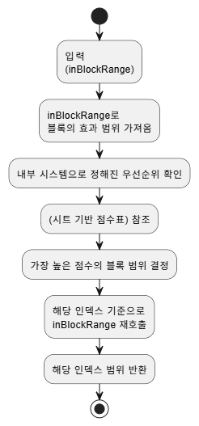

# 🧙 캐릭터 스킬 개발

이 문서는 퍼즐 게임 내 등장 캐릭터들의 고유 능력을 구현한 사례들을 정리한 문서입니다.  
내부 우선순위 탐색 로직, 범위 기반 타격, 상태 변화 등의 핵심 기능 구현내용을 정리했습니다.

---

## 🎯 스킬 범위 탐색 기능

- **설명**: 여러 개의 후보 인덱스 중, 효과 범위 내에서 가장 높은 우선순위를 가진 대상 좌표를 탐색하는 범용 기능
- **기여**:
  - 우선순위 맵 기반 인덱스 필터링 시스템 구현
  - 캐릭터마다 다른 탐색 조건(십자 범위, 3*3범위 등)을 지원할 수 있도록 확장성 있게 설계
  - 특정 조건에 따른 fallback 처리(우선순위 동률 시 랜덤 선택 등) 포함

---

## 🌊 바다의 신 블루

- **설명**: 시작 시, 그리고 일정 턴마다 3줄 범위 내 오브젝트를 파괴하는 강력한 범위형 스킬
- **기여**:
  - 시작 시 자동 발동 및 턴 주기 기반 발동 로직 분리 구현
  - 3줄 범위 타격 연출과 우선순위 대상 오브젝트만 제거되도록 조건식 구성
  - 애니메이션, 이펙트, 진동 등 스킬 사용 시의 연출을 인게임에 자연스럽게 적용

 

---

## 🎨 천재 화가 애니

- **설명**: 블록의 수를 비교해 가장 적은 색깔이 있는 줄을 찾아, 가장 많이 바꿀 수 있도록 블록의 타입으로 변경
- **기여**:
  - 전체 보드 블록 수 카운트 및 컬러 분포 스캔 기능 구현
  - 줄 단위 우선순위 연산 및 최적 대상 줄 탐색 로직 설계
  - 블록 색상 변경 시, 이펙트와 UI 가독성 고려하여 순차적 변화 연출 적용

 

---

## 🌙 달빛 요정 애니

- **설명**: 9칸 범위를 두 번 타격하고, 특정 턴마다 동일 범위의 우선순위 인덱스를 다시 타격하는 지속형 스킬
- **기여**:
  - 9칸 효과 영역 연산 및 내부 타격 처리 루틴 구현
  - 동일 인덱스에 대해 타격한 다음 슬라이딩 후 연속적으로 재발동되도록 스킬 상태 유지 및 주기 처리

 

---
