# 🎮 콘텐츠 개발

이 문서에서는 애니팡3의 콘텐츠 개발 설계와 구현을 중심으로 정리했습니다.

1. [카드모으기 – 컬렉션형 이벤트 콘텐츠](#-카드모으기--컬렉션형-이벤트-콘텐츠)
2. [마녀의 습격 – 로그라이크형 이벤트 콘텐츠](#-마녀의-습격--로그라이크형-이벤트-콘텐츠)
3. [구름길을 건너라 – 실시간 경쟁 생존 콘텐츠](#-구름길을-건너라--실시간-경쟁-생존-콘텐츠)
4. [스타디움 – 최종 스테이지 유저 대상의 랭킹 콘텐츠](#-스타디움--최종-스테이지-유저-대상의-랭킹-콘텐츠)
5. [리메이크 캐릭터룸 & 뽑기 대여 시스템 개발](#-리메이크-캐릭터룸--뽑기-대여-시스템-개발)
6. [만두만들기 – 강화 기반 랭킹 이벤트](#-만두만들기--강화-기반-랭킹-이벤트)
7. [9주년 케이크 – 플레이 기반 응모 이벤트](#-9주년-케이크--플레이-기반-응모-이벤트)
8. [팡팡레이싱 – 일일 경쟁 콘텐츠](#-팡팡레이싱--일일-경쟁-콘텐츠)
9. [5성 캐릭터 대여 시스템](#-5성-캐릭터-대여-시스템)
10. [마녀의탑 리메이크 – 연속 퍼즐 도전 콘텐츠](#-마녀의탑-리메이크--연속-퍼즐-도전-콘텐츠)
11. [펫 시스템 개발 – 인게임 케어 메커니즘](#-펫-시스템-개발--인게임-케어-메커니즘)
12. [플레이 리스트 – 미션 기반 콘텐츠](#-플레이-리스트--미션-기반-콘텐츠)
13. [스테이지 플레이 기반 아이템 지급 이벤트](#-스테이지-플레이-기반-아이템-지급-이벤트)
14. [기타 이벤트 폴리싱](#-기타-이벤트-폴리싱)

---

## 🃏 카드모으기 – 컬렉션형 이벤트 콘텐츠

- **설명**: 인게임 플레이 및 다른 이벤트를 통해 카드팩을 획득하고, 카드를 모아 9개 컬렉션 세트를 완성하여 보상을 받는 컬렉션형 이벤트
- **기여**:
  - MVC 아키텍처 기반으로 컨트롤러, 모델, 뷰(메인/개봉/컬렉션/상점/가이드 등 팝업 10종 이상) 전체를 단독 설계 및 구현
  - 카드 획득 경로별(인게임, 낚시왕, 팡팡운동회 등) 연동 및 카드팩 등급(일반/고급/특수) 분리 처리, 일일 무료 팩 지급 로직 구현
  - 카드팩 개봉 시 3단계 상태 머신(개봉 전 → 개봉 중 → 개봉 후) 기반의 연출 흐름 구성, Spine 애니메이션과 DOTween을 활용한 카드 개봉 궤적 및 별 전환 이펙트 구현
  - 중복 카드 → 별 전환 → 별로 카드팩 교환하는 순환 경제 시스템 설계, 등급별 교환 비용을 서버 설정으로 관리하여 운영 유연성 확보
  - 9개 컬렉션 세트 완성 시 개별 보상 → 스택 기반 연쇄 보상 → 전체 완료 시 코스튬/아이템 분리 지급까지 이어지는 다단계 보상 체계 구현
  - UniRx 기반 일일 리셋 타이머 및 로컬 저장소를 활용한 세션 간 상태(상점 노출, 레드닷, 신규 카드 등) 유지 처리
  <!-- [카드모으기 스크린샷.png] -->
---

## 🧟 마녀의 습격 – 로그라이크형 이벤트 콘텐츠

- **설명**: 보스전 콘셉트의 로그라이크 구조 콘텐츠, 플레이마다 다른 패턴과 보상을 제공
- **기여**:
  - 체력/방어력/공격력 등 전투 스탯 구조 설계, 시트 데이터 기반으로 몬스터별 밸런스 조정 가능하도록 구현
  - 로그라이크형 캐릭터 성장 시스템 설계, 플레이마다 랜덤 제공되는 능력 강화 선택지 구현
  - 보드 매칭 결과를 턴 기반 전투 시스템에 연동, 매칭 수/특수블록에 따른 데미지 계산 및 DOTween 기반 전투 연출 구현
   
  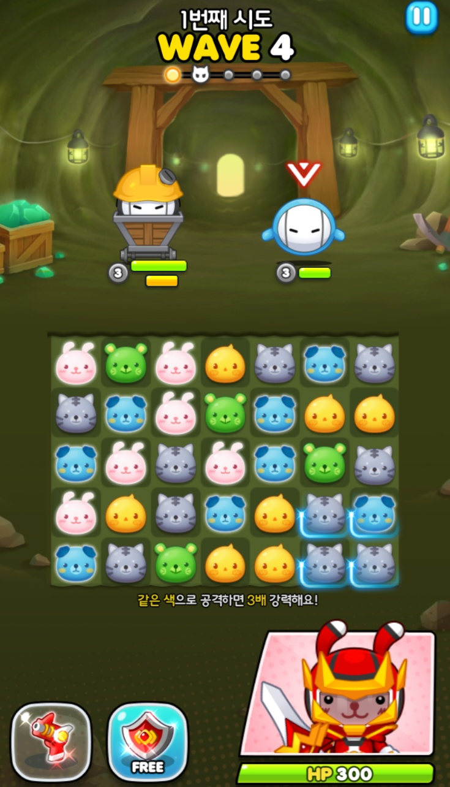
  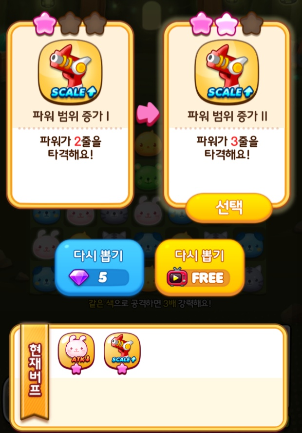
---

## 🌉 구름길을 건너라 – 실시간 경쟁 생존 콘텐츠

- **설명**: 매일 여러 유저가 매칭되어 7개의 레벨을 연속으로 클리어하면 마지막까지 생존한 유저끼리 보상을 나누는 콘텐츠
- **기여**:
  - 서버 데이터 기반 다인 동시 진행 시뮬레이션 및 탈락 처리 시스템 구현, DOTween 기반 타 플레이어 진행 연출
  - 매칭 진입, 중도 이탈, 재도전 및 다음날로 이어지는 이벤트 전체 상태를 서버 동기화 기반으로 설계
  - 복잡한 연출 요구 사항을 클라이언트 측 상태 머신으로 처리하여 서버 API 호출 최소화
   
  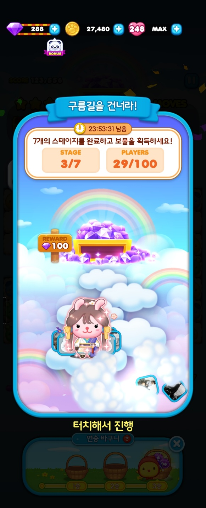
---

## 🏆 스타디움 – 최종 스테이지 유저 대상의 랭킹 콘텐츠

- **설명**: 모든 스테이지를 클리어한 유저들 간 랭킹 경쟁을 위한 엔드 콘텐츠
- **기여**:
  - MVC 아키텍처 기반 이벤트 전체 단독 설계 및 구현, 서버 랭킹 API 연동 및 점수 데이터 구조 설계
  - 전용 월드맵 및 인게임 UI 구성, 시트 데이터 기반으로 기존 스테이지의 턴수/난이도를 전용으로 적용되도록 구현
  - 시즌 기반 보상 지급 시스템 및 시즌 전환 시 데이터 초기화/이전 시즌 결과 보존 처리 설계
   
  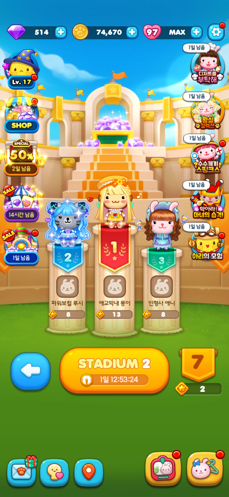
---

## 📦 리메이크 캐릭터룸 & 뽑기 대여 시스템 개발
- **설명**: 캐릭터 뽑기 결과물을 확인하고, 일정 시간 동안 대여해 사용해볼 수 있는 시스템과 새로운 캐릭터룸 연출을 리메이크
- **기여**:
  - 캐릭터룸 메인 UI 및 Spine 기반 캐릭터 상호작용 로직 구성
  - 캐릭터 정보/캐릭터룸/뽑기룸 간 시트 데이터 기반 관계 로직 설계, 스크롤뷰 기반 캐릭터 목록 및 상세 팝업 구현
  - 캐릭터 합성 시 효과 동기화 및 뽑기 결과에 따른 대여 타이머 시스템 연동
   
  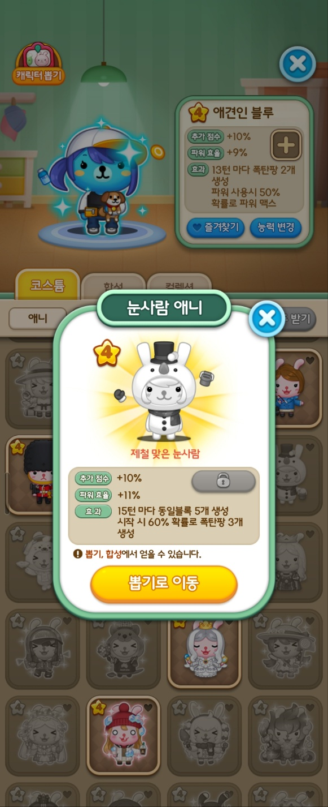
  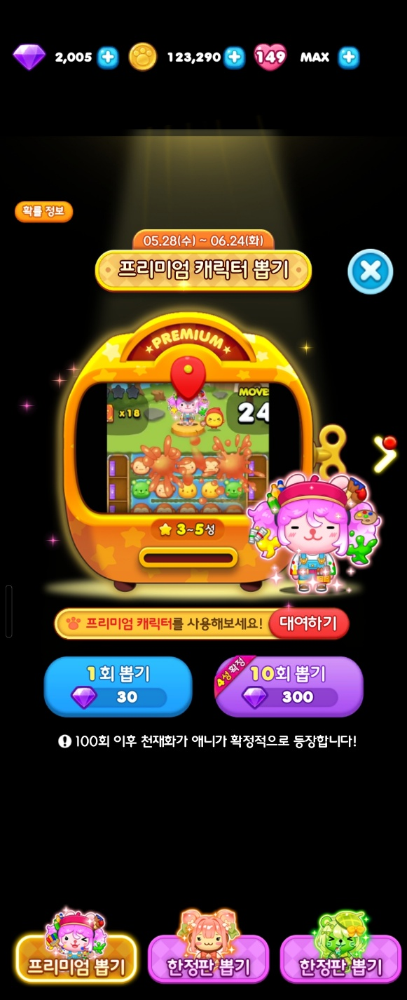
---

## 🥟 만두만들기 – 강화 기반 랭킹 이벤트

- **설명**: 인게임 플레이를 통해 재료를 모아 만두를 단계별로 강화하고, 랭킹 경쟁과 보상을 획득하는 이벤트
- **기여**:
  - 서버 연동 및 데이터 처리 담당으로 이벤트 컨트롤러 로직 전체 개발
  - 20단계 강화 시스템의 확률 기반 성공/실패 판정 및 단계별 Spine 애니메이션 분기 처리 구현
  - 최고 단계 / 누적 점수 이중 랭킹 시스템 서버 연동, LoopListView2 기반 대량 랭킹 리스트 가상 스크롤링 최적화 적용
  - 점수 마일스톤 기반 보상과 최종 단계 도달 후 무한 반복 보상이 순환하는 구조 설계 및 구현
  - 강화 성공/실패 시 DOTween 기반 좋아요 파티클 이펙트 시스템 구현, 3단계 크기 분류와 오브젝트 풀링 적용
  - 서버 API 호출(강화/보상 청구/랭킹 조회/일일 보상 등 6종) 및 콜백 체인 기반 비동기 응답 처리 구현
  <!-- [만두만들기 스크린샷.png] -->
---

## 🎂 9주년 케이크 – 플레이 기반 응모 이벤트

- **설명**: 인게임 플레이와 과금을 통해 티켓을 모으고, 현물 상품에 응모하거나 아이템/캐릭터로 교환하는 주년 기념 이벤트
- **기여**:
  - 컨트롤러부터 뷰(메인/상점/응모/확인/가이드 등 팝업 6종) 작업까지 이벤트 전체를 단독 설계 및 구현
  - 티켓 수집(인게임/과금)과 일일 획득 상한, 응모(현금/가챠 2종), 교환(아이템/캐릭터 4종) 등 복합 경제 시스템의 서버 API 연동 및 상태 관리 구현
  - 교환 횟수 제한, 1회성 교환 잠금, 일일 교환 카운트 등 다양한 조건 분기를 서버 데이터 기반으로 처리
  - UniRx 기반 일일 리셋 타이머 구현 및 교환 상태 초기화 처리
  - 이벤트 종료 후 응모 기간 → 당첨 발표 기간으로 이어지는 시간 기반 강제 노출 로직 구현, 1회성 자동 팝업 관리
  - 주년 이벤트 클라이언트 작업 전체 담당 및 핫픽스 대응
  <!-- [9주년 케이크 스크린샷.png] -->
---

## 🏁 팡팡레이싱 – 일일 경쟁 콘텐츠

- **설명**: 매일 30분 동안 일반 스테이지에서 특수블록 제거를 통해 획득한 점수로 경쟁하는 제한 시간 콘텐츠
- **기여**:
  - UniRx 기반 30분 제한 타이머 구현, 앱 복귀/네트워크 재접속 등 다양한 상황에서의 종료 처리 구현
  - 특수블록 제거 기반의 전용 점수 로직 및 DOTween을 활용한 점수 획득 연출 UI 구성
  - 서버 시간 동기화를 통한 일일 리셋 처리 구현, 중도 이탈/재접속 시 이벤트 상태 복원 및 자연스러운 동기화 구현
   
  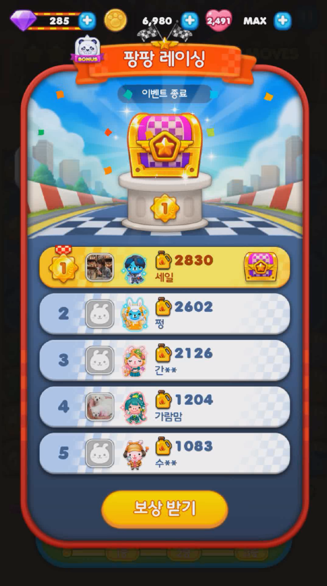
---

## 🎫 5성 캐릭터 대여 시스템

- **설명**: 보유하지 않은 5성 캐릭터를 일정 기간 대여하여 사용해볼 수 있는 시스템 및 이벤트 개발
- **기여**:
  - 싱글턴 패턴 기반의 캐릭터 대여 핵심 시스템 설계 및 구현, 이벤트형과 일일 제공형 양쪽에서 재사용 가능한 구조로 개발
  - UniRx를 활용한 1초 단위 잔여 시간 카운트다운 타이머 및 만료 시 자동 코스튬 복원 로직 구현
  - 대여 코스튬 우선순위 체계 적용 (대여 > 캐릭터패스 > 보유 코스튬), 메인/서브(스킬) 슬롯 구분에 따른 만료 복원 분기 처리
  - 대여 만료 시 즐겨찾기 자동 해제 → 보유 최고 등급 코스튬 자동 장착 → 서버 동기화까지 이어지는 자동 복원 시스템 구현
  - 이벤트 진입 시 프로모션 영상(VideoPlayer) → 코스튬 선택 → 장착 확인으로 이어지는 단계별 플로우 구성, 영상 다운로드 및 로컬 캐싱 처리
  <!-- [5성 캐릭터 대여 스크린샷.png] -->
---

## 🧙 마녀의탑 리메이크 – 연속 퍼즐 도전 콘텐츠

- **설명**: 정해진 턴 수 내 20개의 스테이지를 연속으로 클리어해야 하는 챌린지 모드
- **기여**:
  - 20개 스테이지 연속 플레이 구조 설계 및 코루틴 기반 스테이지 자동 전이 구현
  - 시트 데이터 기반 스테이지 풀에서 조건에 맞는 스테이지를 랜덤 추출하는 로직 설계
  - 실패/성공 조건 판정 및 DOTween 기반 리워드 연출 UI 구성
   
  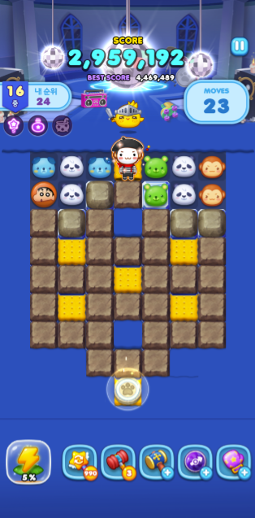
---

## 🐾 펫 시스템 개발 – 인게임 케어 메커니즘

- **설명**: 펫의 상태(배고픔)에 따라 주기적으로 보드 위 오브젝트를 파괴하는 케어 시스템
- **기여**:
  - 턴 기반 조건 분기 처리 및 상태 머신 구현, 펫 배고픔 수치에 따른 발동 주기 제어
  - 펫 컨디션에 따라 트리거되는 보드 오브젝트 파괴 범위 및 우선순위 기반 대상 선정 로직 설계
  - Spine 기반 펫 애니메이션 및 DOTween 기반 파괴 이펙트 연출, 파티클 효과 연동
   
  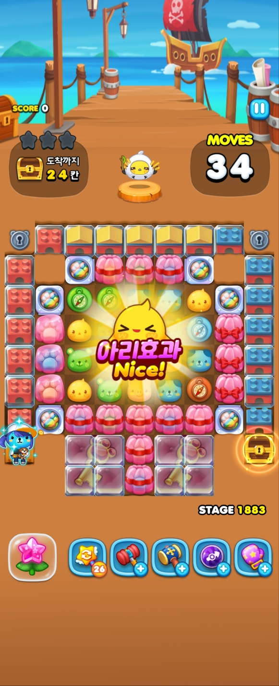
---

## 📋 플레이 리스트 – 미션 기반 콘텐츠

- **설명**: 여러 단계의 미션을 클리어하고 보상을 획득하는 구조의 콘텐츠
- **기여**:
  - 시트 데이터 기반 단계별 미션 설정 및 서버 연동 검증 로직 구성
  - 단계별 보상 및 전체 완료 시 추가 보상 지급 시스템 설계, 서버 API 통한 보상 처리
  - 미션 달성 트래킹 및 서버 데이터 동기화 구현, 진행률 UI 실시간 갱신
   
  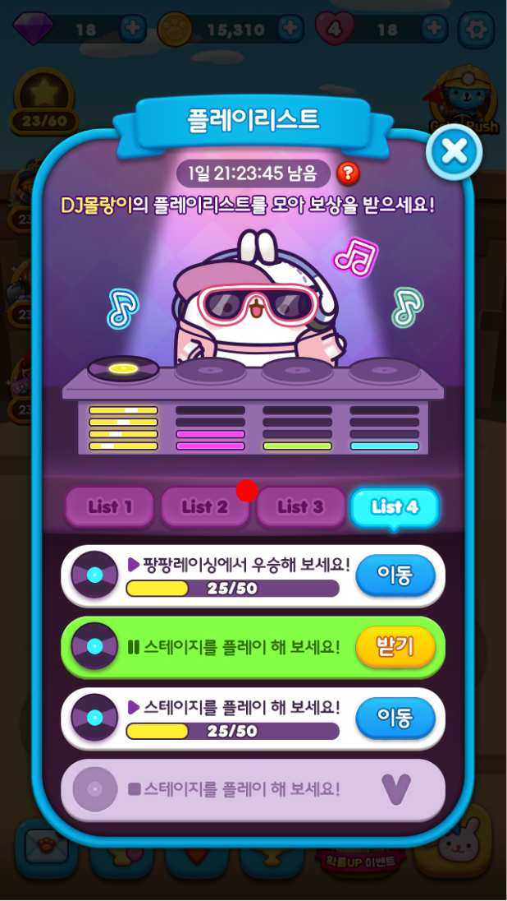
---

## 🎁 스테이지 플레이 기반 아이템 지급 이벤트

- **설명**: 스테이지 클리어 결과에 따라 게이지를 채우고, 목표 달성 시 단계별 보상을 지급하는 이벤트
- **기여**:
  - 컨트롤러부터 UI까지 이벤트 전체 설계 및 구현
  - 고유 스테이지 클리어 판별 및 유효 범위 검증 로직 구현, 중복 클리어 방지 처리
  - DOTween 기반 게이지 채움 애니메이션과 텍스트 카운팅 애니메이션을 병렬 구성, 목표 달성 시 파티클 이펙트 연동
  - 게이지 완성 → 서버 보상 요청 → 보상 팝업 → 게이지 초기화로 이어지는 다단계 비동기 콜백 체인 구현
  - 월드맵 재진입 시 코루틴 기반 동기화 처리 및 업적 시스템 연동을 통한 중복 보상 방지 설계
  <!-- [스테이지 이벤트 스크린샷.png] -->
---

## 🛠 기타 이벤트 폴리싱

- **설명**: 기존 여러 이벤트 콘텐츠들 개선 및 안정화
- **기여**:
  - 팡팡운동화, 낚시왕, 디저트를 부탁해 등 여러 경쟁이벤트 폴리싱 로직 및 UI 적용
  - 출석부, 이벤트 스테이지, 풍선파티, 이벤트 오퍼 등 여러 일반이벤트 폴리싱 로직 및 UI 적용
  - 스타디움 개선 및 버그 수정, 팡팡레이싱 폴리싱 (동시 운영 불가 버그 수정 포함)
  - 구름길 버그 수정, 카드모으기 폴리싱, 웹샵 유도팝업 폴리싱
  - 연승이벤트/슈퍼회전팡이 동일한 기준으로 적용될 수 있도록 내부 구조 정리 및 개선
  - 오래된 여러 이벤트들을 폴리싱하며 이벤트 내부 구조 개선
   
  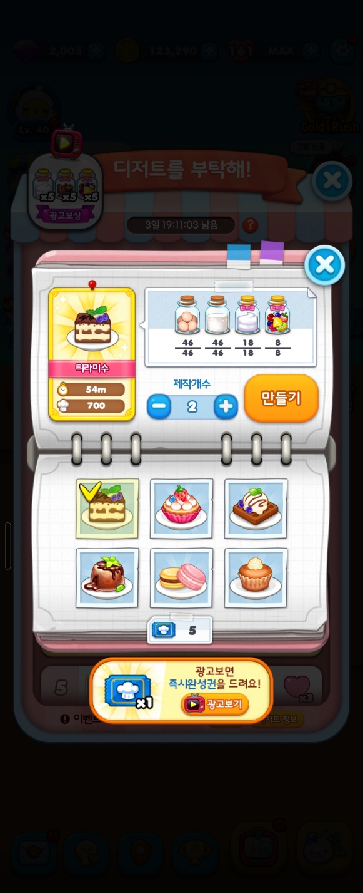
  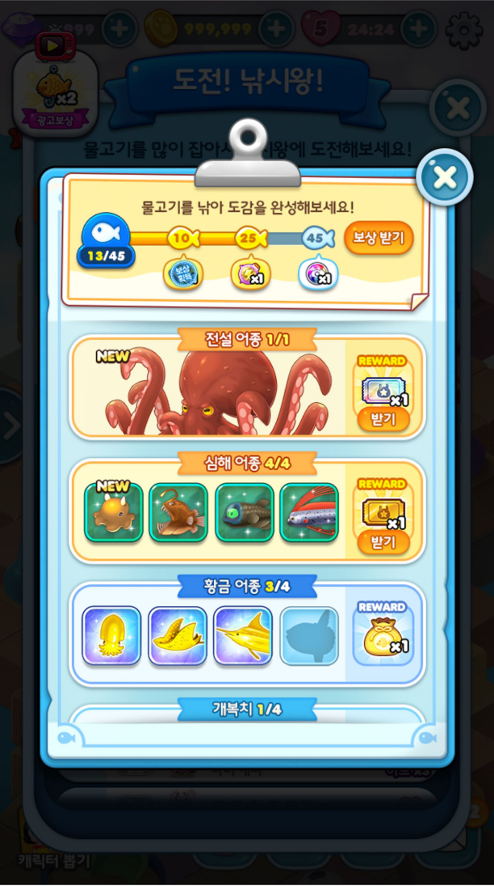
  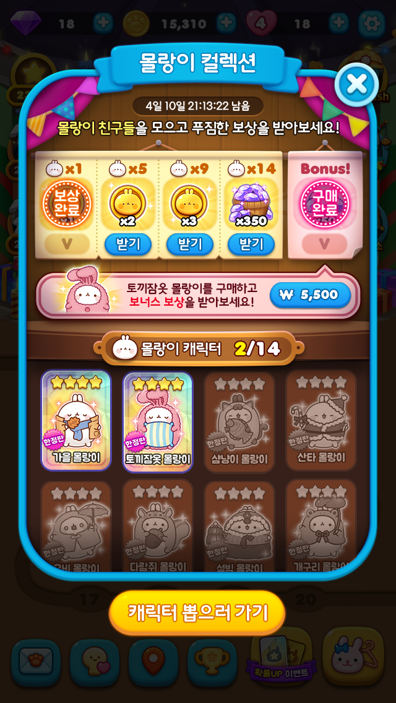
---
