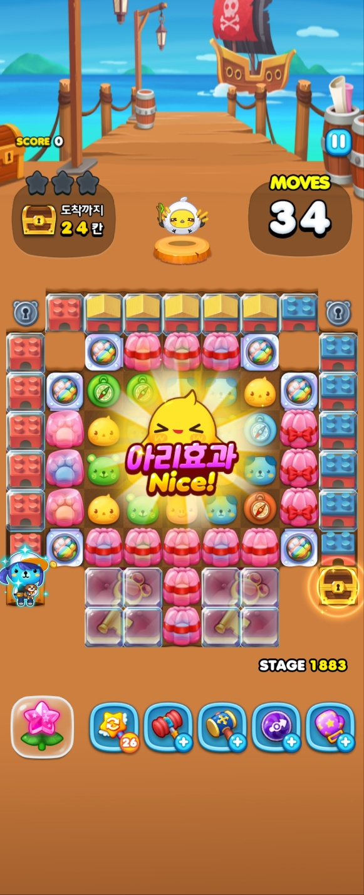
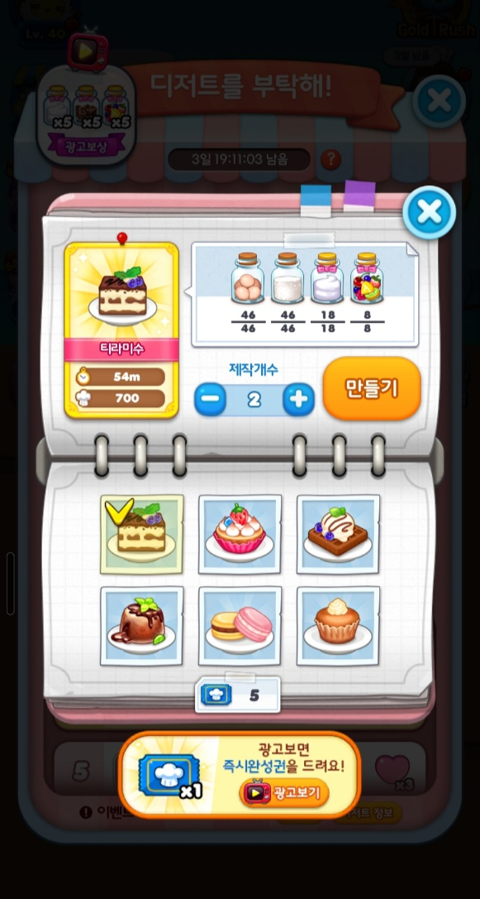
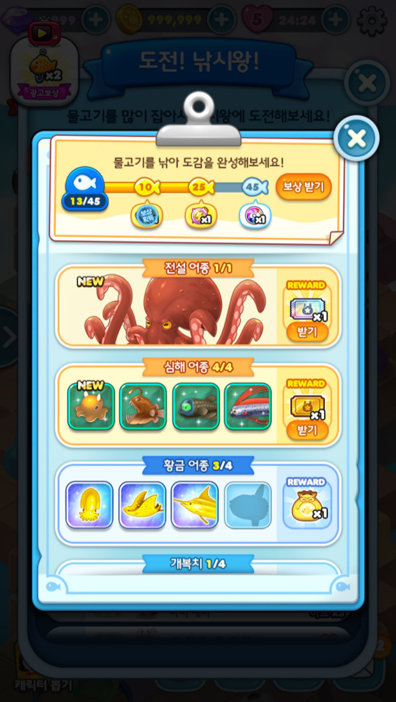

# 🎮 콘텐츠 개발

이 문서에서는 저의 애니팡3의 콘텐츠 개발 설계와 구현을 중심으로 작성되었습니다.

---

## 🏆 스타디움 – 최종 스테이지 유저 대상의 랭킹 콘텐츠

- **설명**: 모든 스테이지를 클리어한 유저들 간 랭킹 경쟁을 위한 엔드 콘텐츠
- **기여**:
  - 최종 점수 결과 기반 랭킹 시스템 연동 및 데이터 구조 설계
  - 전용 월드맵 및 인게임 UI 적용 및 기존 스테이지를 원하는 턴수에 맞게 전용으로 적용되도록 구성
  - 보상 지급 및 연속되는 시즌 시스템 설계
   
  
---

## 🏁 팡팡레이싱 – 일일 경쟁 콘텐츠

- **설명**: 매일 30분 동안 일반 스테이지에서 특수블록 제거를 통해 획득한 점수로 경쟁하는 제한 시간 콘텐츠
- **기여**:
  - 타이머 기반의 이벤트 진입 조건 및 다양한 상황에서의 종료 처리 구현
  - 전용 점수 로직 및 점수 획득 연출 UI 구성
  - 서버와의 연동을 통해 하루가 넘어가면서 발생하는 이벤트 초기화 부분 및 기타 상황에 대한 자연스러운 처리 및 동기화 구현
   
  
---

## 📦 리메이크 캐릭터룸 & 뽑기 대여 시스템 개발
- **설명**: 캐릭터 뽑기 결과물을 확인하고, 일정 시간 동안 대여해 사용해볼 수 있는 시스템과 새로운 캐릭터룸 연출을 리메이크
- **기여**:
  - 캐릭터룸 메인 UI 및 상호작용 로직 구성
  - 캐릭터 정보 팝업과 캐릭터룸, 뽑기룸을 시트를 통해 연결하는 관계 로직 작성
  - 캐릭터 합성 및 캐릭터 효과 캐릭터룸에서 동기화 되도록 구현
   
  
  
---

## 🧟 마녀의 습격 – 로그라이크형 이벤트 콘텐츠

- **설명**: 보스전 콘셉트의 로그라이크 구조 콘텐츠, 플레이마다 다른 패턴과 보상을 제공
- **기여**:
  - 몬스터의 체력, 방어력, 공격력, 플레이어의 공격력 체력 등 전투에 필요한 구조 설계
  - 캐릭터 성장/선택 시스템 설계 (예: 능력 강화 선택지)
  - 몬스터와 플레이어간의 턴 기반의 매칭 상호작용 구현
   
  
  
---

## 🧙 마녀의탑 리메이크 – 연속 퍼즐 도전 콘텐츠

- **설명**: 정해진 턴 수 내 20개의 스테이지를 연속으로 클리어해야 하는 챌린지 모드
- **기여**:
  - 연속 플레이 구조 설계 및 스테이지 자동 전이 구현
  - 임의의 스테이지 추출 로직 작성
  - 실패/성공 조건 UI, 리워드 연출 연계
   
  
---

## 📋 플레이 리스트 – 미션 기반 콘텐츠

- **설명**: 여러 단계의 미션을 클리어하고 보상을 획득하는 구조의 콘텐츠
- **기여**:
  - 단계별 미션 설정/검증 로직 구성
  - 각 단계 별 보상 및 전체 완료 시 추가 보상 지급 설계
  - 미션 달성 트래킹 및 데이터 처리 구현
   
  
---

## 🐾 펫 시스템 개발 – 인게임 케어 메커니즘

- **설명**: 펫의 상태(배고픔)에 따라 주기적으로 보드 위 오브젝트를 파괴하는 케어 시스템
- **기여**:
  - 턴 기반 조건 분기 처리 및 상태 머신 구현
  - 펫의 컨디션에 따라 트리거되는 시각적/기능적 효과 및 상호작용  설계
  - UX 피드백을 위한 애니메이션/이펙트 연동
   
  
---

## 🌉 구름길을 건너라 – 실시간 경쟁 생존 콘텐츠

- **설명**: 매일 여러 유저가 매칭되어 7개의 레벨을 연속으로 클리어하면 마지막까지 생존한 유저끼리 보상을 나누는 콘텐츠
- **기여**:
  - 다인 동시 진행처럼 보일수 있는 로직 및 탈락 처리 시스템 구현
  - 매칭 진입 및 중도 이탈 재도전 및 다음날으로 이어지는 이벤트 전체 상태 처리 설계
  - 연출 기반의 상태처리 요구 사항을 서버 API 호출을 최소화 하는 방향으로 구현
   
  
---

## 🛠 기타 이벤트 폴리싱

- **설명**: 기존 여러 이벤트 콘텐츠들 개선
- **기여**:
  - 팡팡운동화, 낚시왕, 디저트를 부탁해 등 여러 경쟁이벤트 폴리싱 로직 및 UI 적용
  - 출석부,이벤트 스테이지,풍선파티,이벤트 오퍼 등 여러 일반이벤트 폴리싱 로직 및 UI 적용
  - 오래된 여러 이벤트들을 폴리싱하며 이벤트 내부 구조 개선
   
  
  
  
---
