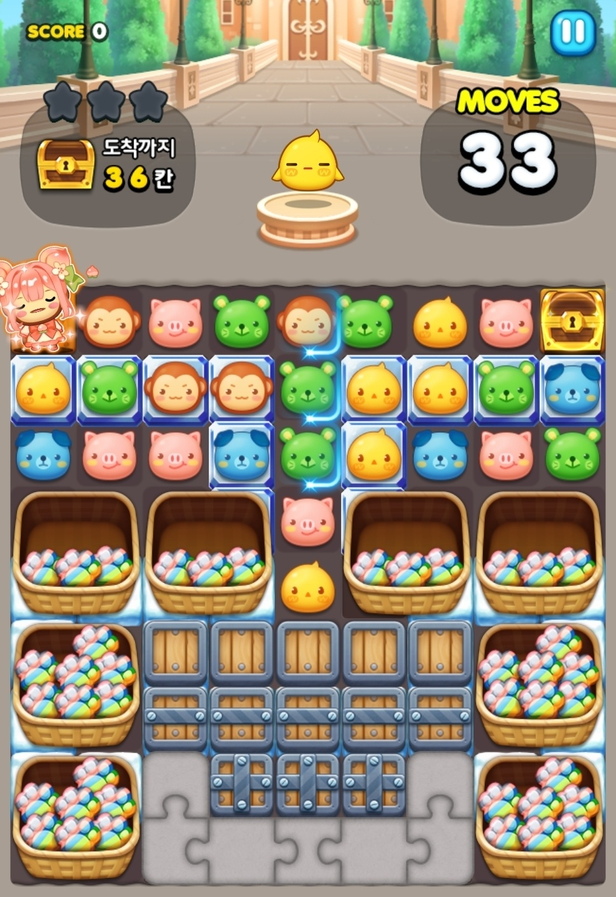
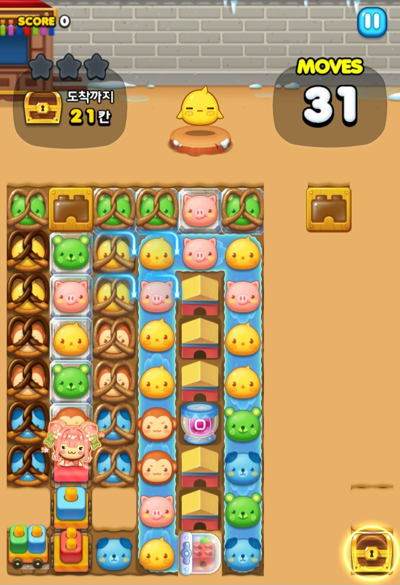

# 🧱 인게임 오브젝트 개발

이 문서는 퍼즐 게임 내 주요 상호작용 오브젝트를 구현한 사례를 정리합니다. 오브젝트들의 특성과 개발 포인트를 설명합니다.

---

## 🔁 컨베이어 벨트

- **설명**: 모든 오브젝트를 매 턴마다 지정된 방향으로 한 칸씩 밀어주는 보드 바닥 오브젝트
- **기여**:
  - 고정 인덱스 기반 오브젝트 이동 로직 구현
  - 맵 끝에 도달한 오브젝트는 사라지고, 반대편에서 새로 생성되는 구조 구현
  - 생성/소멸 시점에서 오브젝트 간 간섭을 방지, 최적화를 위한 **더미 오브젝트 풀링 시스템** 도입
  - 턴 연동 이벤트 큐를 통한 애니메이션 연출 처리

 

---

## 🐙 먹물 문어

- **설명**: 주변 타격 혹은 매칭 시, 주변 9칸에 먹물 오브젝트를 생성하며 사라지는 장애물
- **기여**:
  - 파괴 순간, 겹쳐 생성 가능한 먹물 오브젝트 스폰 시스템 구현
  - 기존 오브젝트 위에 생성될 수 있도록 **우선순위 충돌 처리**
  - 오브젝트 다중 배치/타격에 따른 예외처리 및 안정성 개선

 

---

## 🪞 장식장

- **설명**: 내부 장애물을 모두 제거해야 파괴되는 그룹형 오브젝트
- **기여**:
  - 그룹 내 오브젝트 체력 연동 시스템 구현 (일부 타격 → 전체 연쇄 파괴)
  - 특정 범위 내 타격/연쇄 파괴 조건 구현
  - 다단계 시각효과 및 충족 조건 연출 설계

 

---

## 📦 나무 상자 (폴리싱)

- **설명**: 기존의 최대 3겹 바위에서 스킨을 설정할 수 있고 최대 6겹까지 지원하는 장애물로 리팩토링
- **기여**:
  - 겹 수 증가에 따른 시각 효과 및 충돌 처리 개선
  - 기존 오브젝트의 스킨 처리 및 애니메이션/파티클 연동
  - 기획자가 단계별 설정할 수 있도록 맵툴에 데이터 연동
 
   
  
---

## 🍬 과자 감옥

- **설명**: 블록과 함께 존재하며 해당 블록의 이동을 제한하는 장애물
- **기여**:
  - 이중 존재 오브젝트 (블록+장애물) 상태 처리 및 충돌 감지 적용
  - 플레이어 행동에 따라 감옥만 제거되는 조건 분리 처리
  - 감옥 상태 시 시각적 강조 및 애니메이션 처리
 
   
  
---

## 🌊 해류

- **설명**: 맵툴 상에서 지정된 방향으로 블록을 이동시키는 타일형 오브젝트
- **기여**:
  - 디자이너가 마우스로 방향을 지정할 수 있는 편집 툴 기능 개발
  - 영역 기반 자동 흐름 연산 및 매칭 로직 분리 처리
  - 다양한 흐름 조합에도 오브젝트 충돌이 발생하지 않도록 예외 제어

---

## 🐛 핵심 인게임 버그 수정

- **설명**: 출시 초기부터 존재하던 보드 상에서의 **슬라이딩 버그**를 구조적으로 해결
- **기여**:
  - 원인 미상의 조건에서 발생하는 블록과 패스 설정 및 이동, 실제 데이터와 애니메이션상의 좌표 불일치 문제 해결
  - 퍼즐 엔진 동작 방식에 대한 이해를 바탕으로 발생 감지 및 보드 상태 재동기화 처리

---
