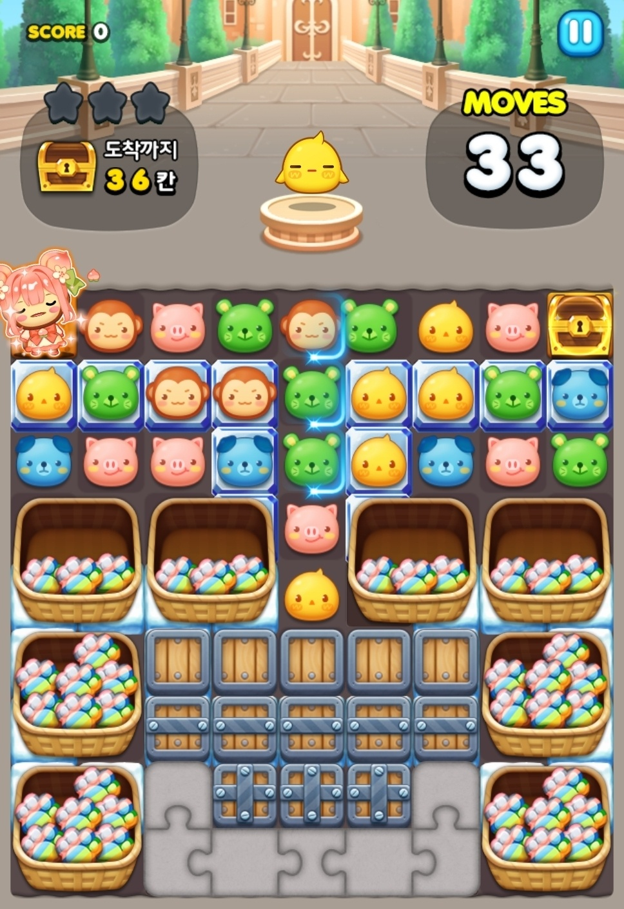
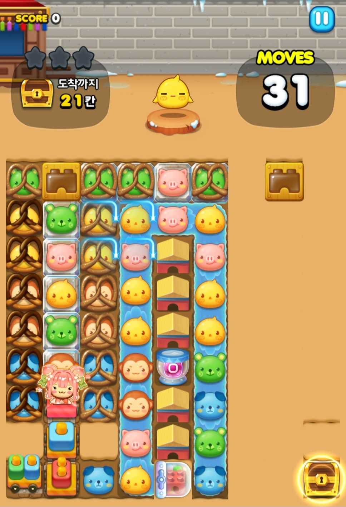
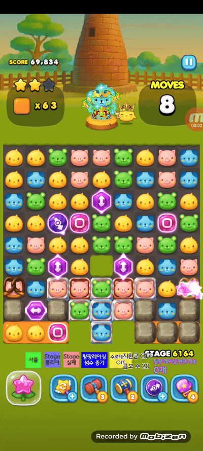

**Tech Keywords**
- Match-3 Board Logic
- Object Interaction System
- Object Pooling
- DOTween Animation Sync

# 인게임 오브젝트 개발

이 문서는 퍼즐 게임 내 주요 상호작용 오브젝트를 구현한 사례를 정리합니다. 오브젝트들의 특성과 개발 포인트를 설명합니다.

---

## 컨베이어 벨트

- **설명**: 모든 오브젝트를 매 턴마다 지정된 방향으로 한 칸씩 밀어주는 보드 바닥 오브젝트
- **기여**:
  - 인덱스 기반 좌표 연산으로 매 턴 오브젝트 위치 이동 처리, 맵 경계 도달 시 소멸 및 반대편 재생성 래핑 구조 설계
  - 오브젝트 풀링 시스템을 활용한 더미 오브젝트 관리로 생성/소멸 시점의 간섭 방지 및 성능 최적화
  - 이벤트 큐 기반 턴 연동 처리로 DOTween 이동 애니메이션과 게임 로직의 동기화 구현

<br>


---

## 먹물 문어

- **설명**: 주변 타격 혹은 매칭 시, 주변 9칸에 먹물 오브젝트를 생성하며 사라지는 장애물
- **기여**:
  - 3×3 인접 탐색 기반 먹물 오브젝트 스폰 시스템 구현, 파괴 순간 주변 9칸에 동시 생성 처리
  - 오브젝트 레이어 우선순위 충돌 처리로 기존 오브젝트 위 중첩 배치 지원
  - 다중 동시 파괴 시 스폰 타이밍 제어 및 예외 처리로 런타임 안정성 확보

<br>


---

## 장식장

- **설명**: 내부 장애물을 모두 제거해야 파괴되는 그룹형 오브젝트
- **기여**:
  - 그룹 인덱스 기반 다중 셀 오브젝트 체력 연동 시스템 구현, 내부 장애물 전멸 시 그룹 전체 파괴를 트리거하는 조건부 연쇄 로직 설계
  - DOTween을 활용한 다단계 파괴 시각 이펙트 및 충족 조건 달성 연출 구현

<br>


---

## 나무 상자 (폴리싱)

- **설명**: 기존의 최대 3겹 바위에서 스킨을 설정할 수 있고 최대 6겹까지 지원하는 장애물로 리팩토링
- **기여**:
  - 기존 3단계에서 최대 6단계까지 HP 시스템 확장 리팩토링, 겹 수 증가에 따른 충돌 처리 개선
  - Spine 스킨 시스템을 활용한 단계별 외형 변화 처리 및 파티클 이펙트 연동
  - 맵툴 에디터에 단계별 설정 UI 추가, 시트 데이터 기반 파라미터 분리로 기획자가 직접 설정 가능하도록 구성
 
  <br>
  
---

## 과자 감옥

- **설명**: 블록과 함께 존재하며 해당 블록의 이동을 제한하는 장애물
- **기여**:
  - 블록 + 장애물 이중 레이어 오브젝트 상태 관리 구현, 충돌 감지 시 레이어별 독립 처리
  - 블록 이동 제한 조건과 감옥 제거 조건을 분리한 독립적 상태 처리 로직 설계
  - DOTween 기반 감옥 상태 시각적 강조 및 제거 애니메이션 구현
 
  <br>
  
---

## 해류

- **설명**: 맵툴 상에서 지정된 방향으로 블록의 흐름을 제어하는 타일형 지점 (맵툴용)
- **기여**:
  - Unity Editor 확장을 활용한 방향 지정 커스텀 편집 툴 개발, 디자이너가 마우스 드래그로 흐름 방향을 직관적으로 설정 가능
  - 방향 벡터 기반 블록 흐름 연산과 매칭 로직의 분리 처리
  - 복합 흐름 조합에서의 오브젝트 충돌 방지를 위한 예외 제어 구현
  
---

## 물감채우기

- **설명**: 보드 위 특정 영역을 블록 매칭을 통해 물감으로 채워나가는 미션형 오브젝트
- **기여**:
  - 상태 관리, 형태 결정, 시각화를 분리한 3계층 구조 설계 및 구현
  - 8방향 인접 타일 탐색 시스템 구현, 보드 경계에서의 래핑 방지를 위한 행/열 유효성 검증 처리
  - 인접 타일 조합에 따라 6가지 형태(끝점/곡선/직선/T자/교차/사면 연결)와 4방향 회전 + 모서리 스프라이트를 동적으로 결정하는 타일 자동 생성 시스템 구현
  - 블록 매칭/파괴 발생 시 빈 공간으로 물감이 퍼지는 확산 로직 구현, 확산 후 주변 8방향 타일 형태 재계산 처리로 시각적 연속성 보장
  - 단순 직선 방향 확장뿐 아니라 회전팡을 사용한 360도 방향의 확산 기능 구현
  <br>
  

<details>
<summary><b>핵심 구조 — 8방향 인접 탐색 기반 타일 형태 자동 결정</b></summary>

#### 설계 의도

물감 타일은 인접한 타일의 유무에 따라 모양이 달라져야 합니다.
새 타일이 추가되면 본인뿐 아니라 **주변 기존 타일의 형태도 바뀔 수 있으므로**,
확산 시 전체 활성 타일을 재계산하는 구조로 설계했습니다.

```csharp
// --- 물감 확산 흐름 (구조 예시) ---
bool hasNewTile = false;

foreach (int index in destroyedIndices)
{
    // 기존 보드나 장애물이 없는 빈 공간에만 확산 가능
    // +기타 예외 처리
    if (CanSpreadTo(index))
    {
        CreateNewTile(index);
        hasNewTile = true;
    }
}

if (!hasNewTile) return;

// 새 타일이 추가되면 모든 활성 타일의 형태를 재계산
// → 인접 관계가 바뀌었으므로 기존 타일도 형태가 달라질 수 있음
foreach (var tile in activeTiles)
{
    RecalculateShape(tile.Key);
}
```

#### 8방향 인접 탐색 → 형태 결정 → 렌더링

```csharp
// --- 8방향 인접 탐색 → 형태 결정 (구조 예시) ---
// 상하좌우 4방향 연결 패턴의 조합은 2^4 = 16가지이지만,
// 회전 대칭을 고려하면 6가지 기본 형태로 축소됨.
// "상·우 연결 여부"로 1차 분기한 뒤 나머지를 판정하는 방식으로 분기 깊이를 최소화.

// 형태 결정 결과: 6가지 기본 형태 × 4방향 회전 + 모서리
// type 1~6: 끝점 / 직선 / 곡선 / T자 / 교차 / 사면연결
// rotation: 0 / 90 / 180 / 270
// cornerLT, cornerRT, cornerLB, cornerRB: 모서리 스프라이트 표시 여부

{
    // 8방향 인접 셀 중 같은 타입의 타일을 수집
    List<int> adjacentIndices = GetEightDirectionIndices(index);
    List<TileData> neighbors = new();

    foreach (int adj in adjacentIndices)
    {
        if (adj < 0 || adj >= BOARD_TOTAL) continue;
        if (_activeTiles.ContainsKey(adj))
            neighbors.Add(_activeTiles[adj]);
    }

    // 상하좌우 4방향 연결 상태로 기본 형태(6종) + 회전각 결정
    // + 대각선 4방향으로 모서리 스프라이트 on/off 결정
    var painter = new TileShapePainter();
    ShapeResult result = painter.DetermineShape(_activeTiles[index], neighbors);

    // 결정된 형태로 스프라이트 교체 + 회전 적용 + 모서리 렌더링
    var renderer = GetTileRenderer(index);
    renderer.SetBaseSprite(result.type, result.rotation);
    renderer.SetCornerEdges(result.cornerLT, result.cornerRT,
                            result.cornerLB, result.cornerRB);
}
```

이 구조 덕분에 물감 확산 시 타일 간 시각적 연속성이 자동으로 유지되며,
새로운 타일 타입(먹물 등)을 추가할 때도 `TileShapePainter`를 상속받아
색상과 스프라이트만 교체하면 동일한 형태 결정 로직을 재사용할 수 있었습니다.

</details>

---

## 오브젝트 미션화 시스템

- **설명**: 기존에 장애물로만 존재하던 인게임 전체 오브젝트들을 미션 목표로 활용할 수 있도록 시스템화
- **기여**:
  - HP 기반 미션 오브젝트 시스템 구현, 미션북의 HP가 최대치에 도달하면 트리거되는 상태 머신
  - 그룹 인덱스를 활용하여 하나의 미션북이 여러 보드 위치의 오브젝트를 동시에 대상으로 지정할 수 있는 다중 타겟 미션 구조 구현, 상위 오브젝트 중첩 여부 검증 포함
  - 기존 오브젝트(나무상자, 먹물 문어, 장식장, 과자 감옥 등)에 미션 대상 속성을 부여하여 "나무상자 10개 파괴" 등의 미션을 기획자가 맵툴에서 설정 가능하도록 적용
  - 오브젝트 파괴 시 미션 카운트 연동, 달성 판정 및 배경 이펙트 생성을 통한 시각적 피드백 구현

---

## 핵심 인게임 버그 수정

- **설명**: 출시 초기부터 존재하던 보드 상에서의 **슬라이딩 버그**를 구조적으로 해결
- **기여**:
  - 블록 좌표 데이터와 코루틴 타이밍 간 불일치 원인 분석 및 해결
  - 퍼즐 엔진의 슬라이딩 파이프라인 분석을 통한 구조적 원인 파악, 보드 상태 검증 및 재동기화 로직 구현으로 런타임 안정성 확보

---
